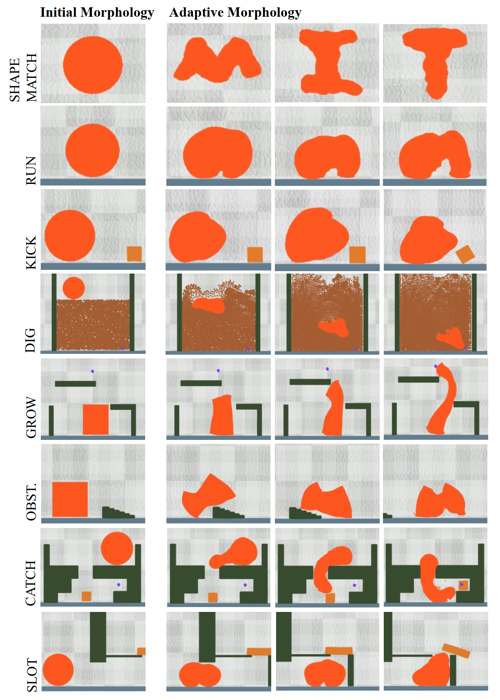

# Morphological Maze

#### [[Project Website]](https://morphologicalmaze.github.io/) [[Paper]](./paper/Morphological_Maze_Control_Reconfigurable_Soft_Robots_with_Fine_grained_Morphology_Change.pdf)

[Suning Huang<sup>1</sup>](https://suninghuang19.github.io/), [Boyuan Chen<sup>2</sup>](https://boyuan.space/), [Huazhe Xu<sup>1</sup>](http://hxu.rocks//), [Vincent Sitzmann<sup>2</sup>](https://www.vincentsitzmann.com/) <br/>
<sup>1</sup>Tsinghua <sup>2</sup>MIT </br>


This repo is the official environment implementation of ***[Morphological Maze: Control Reconfigurable Soft Robots with Fine-grained Morphology Change](https://morphologicalmaze.github.io/)***. We set up a comprehensive benchmark including 8 different tasks for facilitating the research on novel highly reconfigurable robot. If you find this work helpful to your research, please cite us as:

```
@inproceedings{
}
```

For questions about code, please create an issue on github. For questions about paper, please reach me at hsn19@mails.tsinghua.edu.cn

*****

#### To create environment, simply run the following command:

```python
pip install git+https://github.com/suninghuang19/morphmaze.git
```

#### You can run the following command to check if successfully installed:

```python
python test_env.py
```


### Benchmark Introduction

**<font color=red>Videos can be found at [here](https://morphologicalmaze.github.io/).</font>**

- **SHAPE MATCH:** The robot is initialized as a circle in a zero-gravity environment. It has to alter its shape to mirror predefined geometric or alphabetical form. The score is calculated on the basis of the congruence between the robot's current shape and the target shape.
- **RUN:** The robot is initialized on a plain and the task requires a robot to move forward to the greatest possible distance within a stipulated period. The score is governed by the distance traversed and the speed maintained.
- **KICK:** The robot is initialized as a circle and is designed to kick a square target to the maximum possible distance. Ground friction prevents simple pushing, therefore the robot is required to use a flipping and rolling technique.
- **DIG:** The robot is initially in the shape of a circle placed on the top of a soil-filled container, aiming to reach a target located at the bottom-right corner.
- **GROW:** The robot is initialized as a square on the ground and is required to extend its superior segment to reach a target represented by a purple dot. Multiple obstacles hinder the direct route to the target. The reward function measures the distance between the target point and the robot.
- **OBSTACLE:** The robot, in the shape of a square, faces an obstacle in its path while the task is to move forward. The score is based solely on how far the obstacle is bypassed.
- **CATCH:** The circular robot, placed outside a cube, is tasked with manipulating a small square target within the cube to a specific point. The score is computed considering the distance between the robot and the cube, as well as the cube and the final point.
- **SLOT:** The circular robot, initially outside a box with only a narrow slot to get inside, must squeeze its body through the slot and manipulate a cap target on top of the box. The reward function measures the distance between the robot and the cap, and whether the cap was successfully removed from the box.



**MorphMaze ENV Parameters:**

|  Env Name  | Observation Resolution | Coarse Action Resolution (env-coarse-v0) | Fine Action Resolution (env-fine-v0) | Upsample Action Signal to Fit Final Action Field |
| :--------: | :--------------------: | :--------------------------------------: | :----------------------------------: | :----------------------------------------------: |
| shapematch |      (64, 64, 3)       |               (32, 32, 2)                |             (64, 64, 2)              |                   (64, 64, 2)                    |
|    run     |      (64, 64, 3)       |                (8, 8, 2)                 |             (16, 16, 2)              |                   (64, 64, 2)                    |
|    kick    |      (64, 64, 3)       |                (8, 8, 2)                 |             (16, 16, 2)              |                   (64, 64, 2)                    |
|    dig     |      (64, 64, 3)       |                (8, 8, 2)                 |             (16, 16, 2)              |                   (32, 32, 2)                    |
|    grow    |      (64, 64, 3)       |                (8, 8, 2)                 |             (16, 16, 2)              |                   (64, 64, 2)                    |
|  obstacle  |      (64, 64, 3)       |                (8, 8, 2)                 |             (16, 16, 2)              |                   (64, 64, 2)                    |
|   catch    |      (64, 64, 3)       |                (8, 8, 2)                 |             (16, 16, 2)              |                   (64, 64, 2)                    |
|    slot    |      (64, 64, 3)       |                (8, 8, 2)                 |             (16, 16, 2)              |                   (64, 64, 2)                    |

#### If you want to set up a gym environment, just run:

```python
import gym
import taichi as ti
import morphmaze

ti.init(arch=ti.gpu)
# init coarse env
env = gym.make("shapematch-coarse-v0")
# init fine env
env = gym.make("shapematch-fine-v0")
```

